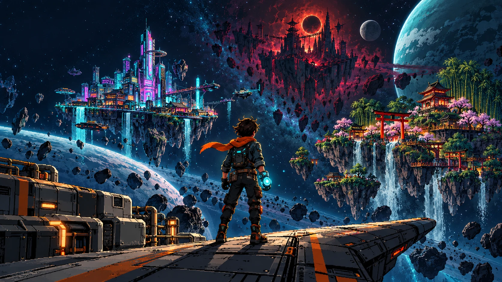

# Project X — Quantum Shift

**A personal JavaScript / Excalibur.js sci-fi adventure, developed independently of the Godot school project.**

Explore themed planets from a top-down view. Use the Omni-Tool to rewrite reality through randomly assigned hack minigames. Enemy encounters open a separate battle interface; successful hacks deal damage, failed hacks invite a counterattack.



## Run locally

Requires Node.js 20.19+ or 22.12+.

```bash
npm ci
npm run dev
```

Open the local URL printed by Vite. Choose **Begin je reis** and follow the short prologue and Omni-Tool tutorial. The game interface and dialogue are in Dutch.

```bash
npm run build
npm run preview
```

The production build is written to `dist/`. The relative Vite base supports hosting in a repository subfolder. Publish that **build output**, not the source folder.

## GitHub Pages — fixing a white screen / main.js 404

The source `index.html` needs Vite to compile its imports. Publishing the repository directly using **Deploy from a branch** does not build the game and can produce a white screen with a `src/main.js` 404.

1. Open **Settings → Pages** in this repository.
2. Under **Build and deployment → Source**, select **GitHub Actions**.
3. Open **Actions → Build and publish game → Run workflow → main**.
4. Wait for both **build** and **deploy** to turn green, then open the Pages URL and refresh with Ctrl+Shift+R.

The included workflow runs the unit tests, builds Vite, and publishes only `dist/`. Later pushes to `main` update the game automatically. Do not add the default Jekyll/branch publishing workflow: it publishes uncompiled source. Other static hosts should also use build command `npm run build` and output directory `dist`.

## What is playable?

| Chapter | Destination | Main story                                                                                       | Resolution                                                                                            |
| ------- | ----------- | ------------------------------------------------------------------------------------------------ | ----------------------------------------------------------------------------------------------------- |
| 01      | **NEON**    | Ilo needs the energy relay restored. Its success reveals the route to the pirate cargo manifest. | Defeat K-9 to obtain KAGE's coordinates.                                                              |
| 02      | **KAGE**    | Ren wants to repair a gravity anchor; Kaito wants to overload it.                                | The player's choice affects Vane's starting health and the ending. Defeat Vane to reveal the Citadel. |
| 03      | **CITADEL** | Breach the prison's security core and reach the captain, your uncle.                             | Defeat his Mech-Tech Armour, reunite with your parents, and follow the epilogue.                      |

Also included:

- The **Wayfarer**, your cargo ship and safe hub, with healing and a shop.
- A destination map with **12 concept destinations, including one station**. Only the three chapters above are implemented as playable worlds; the other nine are clearly marked as concepts.
- **16 random hack minigames:** timing bar, ordered pulses, symbol memory, matching wires, cause and effect, rhythm targets, cursor maze, chess mate-in-one, ordered numbers, rotating pipes, frequency tuning, keypad memory, moving targets, filter cleanup, energy balance and symbol locks.
- Three **3072 × 2048 worlds** illustrated directly in Canvas: controlled linework, smooth surfaces, authored architecture and streets that match navigation. NEON has workshops and canals; KAGE has samurai temples, torii, lanterns and sakura; CITADEL has industrial prison blocks.
- **18 residents** with walking routes, idle pauses, varied clothing and nearby interaction. Thirteen sidequests, including multi-objective follow-ups for Mira, Hana and Dr. Vale, plus stories for Nori, Juno, Taro, Zen, Sera and ECHO.
- A local map (**L**) with NPC, boss and landmark markers. Clicking a marker plans a street route; ground clicks also navigate around obstacles.
- Rain on NEON, drifting petals on KAGE and embers in the CITADEL.
- An optional practice terminal on each planet: practice randomly assigned hacks without taking damage.
- **Eight collectible special Chips**, two active slots, and a persistent loadout: damage, extra hack time, protection, movement, bonus Stars and healing. The original three base software upgrades remain compatible with older saves.
- **Six traders**, including **three wandering traders** with district routes, separate stock, repair services and cargo trading. Prism lenses, quantum relays, crystal blossoms and imperial seals can be sold for Stars.
- Tracked sidequest objectives appear on the radar and local map. Follow-up quests unlock after returning to their giver. Rewards can be claimed once; a duplicate special Chip becomes 30 Stars.
- Planet-specific presentation with the same minigame rules across destinations.
- Ground loot, chests, enemy rewards, and three optional hidden archives.
- **Stars** for purchases, **bolts** for movement hardware upgrades or recycling, and **chips** for battle damage upgrades.
- A post-campaign quest, **Echo's van het verleden**: find all three archives for an extra reward and a piece of the family's backstory.
- A six-scene **manga prologue**, illustrated encounters with important main-quest and sidequest characters, 18 people with closed/speaking portrait frames, robot speech lights and Dutch subtitles. Replay the opening from the Wayfarer.
- A diagonal encounter transition with the original **De Gebroken Zon** pirate emblem, plus first-encounter boss confrontations.
- **Three enemy gangs**, one per world. Choose a target between random hacks, defeat every member to win, and reduce counterattack pressure by eliminating support units. Gang loot and quest completion are awarded once for the full encounter.
- Browser-local saves, a journal, synthesized sound effects, and responsive UI.
- Collision encounters with drones; nearby objects, NPCs and bosses can also be activated with the interaction key or a click.

This is a compact proof of concept, not the full 12-destination campaign. Progress is stored only in the current browser and origin; there is no account or cloud save. Maps use authored Canvas layouts with individual illustrated buildings, walkable geometry, interactive objects and animated residents. The older generated map paintings remain available as reference assets. The standalone hacking arena deliberately pauses exploration while the player completes its timed task.

## Controls

| Input                     | Action                                                  |
| ------------------------- | ------------------------------------------------------- |
| WASD / arrow keys         | Move                                                    |
| Click the ground          | Move toward the clicked point                           |
| E / click a nearby object | Interact                                                |
| Space                     | Dash in the world; stop the timing bar during that hack |
| 1–4                       | Memory puzzle inputs                                    |
| M                         | Destination map                                         |
| L                         | Local map with click-to-route markers                   |
| I                         | Special Chip loadout and cargo inventory                |
| J                         | Journal                                                 |
| Escape                    | Close a menu / open the control guide                   |

If a battle goes badly, retreat and heal for free on the ship. Losing all health returns you to the safe hub without deleting mission progress. New chapters unlock through boss victories. Explore previously visited planets after the ending.

## Architecture

| File                    | Responsibility                                                                         |
| ----------------------- | -------------------------------------------------------------------------------------- |
| `src/main.js`           | Game controller, story, dialogue, quest state, arenas, shop and menus                  |
| `src/world.js`          | Excalibur engine, planet scenes, collisions, movement, proximity and click interaction |
| `src/data.js`           | Destination definitions, object positions, quest objectives and unlock rules           |
| `src/art.js`            | Excalibur graphics, map caching and weather                                            |
| `src/world-renderer.js` | Authored map illustration and shared radar/local-map images                            |
| `src/entities.js`       | Smooth character, ship, terminal and enemy graphics                                    |
| `src/story.js`          | Manga prologue, cast and boss introductions                                            |
| `src/characters.js`     | Original animated manga portraits                                                      |
| `src/cinematics.js`     | Subtitle reveal, portrait animation and encounter transitions                          |
| `src/encounters.js`     | Gang definitions, target selection, counters and encounter rewards                     |
| `src/levels.js`         | District geometry, resident routes, story targets and grid pathfinding                 |
| `src/contracts.js`      | Thirteen sidequests, objective checks, chains and tracking                             |
| `src/progression.js`    | Special Chips, loadout, trader stock and cargo economy                                 |
| `src/sprites.js`        | Archived pixel character drawing, retained as reference                                |
| `src/hack-catalog.js`   | Sixteen task definitions and curated chess positions                                   |
| `src/extra-hacks.js`    | Eleven extra puzzle, timing and skill challenges                                       |
| `src/hacks.js`          | Independent minigame UI, input, timers, success/failure and cleanup                    |
| `src/state.js`          | Local saves, rewards, purchase rules and random hack selection                         |
| `src/ui.js`             | Reusable UI icons, portraits and mech presentation                                     |
| `src/audio.js`          | Synthesized sounds; no audio files or autoplay music                                   |
| `src/style.css`         | Responsive sci-fi interface and themed hacking presentation                            |

**Important separation:** the selected minigame is the **task**, the target object or encounter determines the **result**, and the planet determines the **theme**. A timing test does not always mean a gravity effect. Every offered task has a valid completion path. A boss does not require drawing one particular random hack.

The actual school project remains in **Godot**. This code does not modify or convert that project.

## Tests

```bash
npm test
npx playwright install chromium
npm run test:e2e
```

The Node tests cover save validation, chapter progression, Stars spending, upgrade caps, hack selection, destination data and multi-enemy targeting/rewards. The browser suite plays the tutorial and campaign through the real UI, checks all sixteen minigames, validates failure damage and retreat, checks walking NPCs, collision boundaries, map routing, single-claim sidequest rewards, wandering trade, equipment persistence and cargo sales, checks the manga prologue, animated subtitles and full gang victory, and inspects narrow-screen layout. Test-only `?debug=1` exposes the controller for positioning characters efficiently; tests still solve the minigames and click their actual controls. A preinstalled browser can be selected with `PX_TEST_CHROME`.

## Art and dependencies

The title, original portrait sheet, archived world paintings, twelve manga story panels, 36 transparent portrait frames and six architecture sprites were generated specifically for this project. Current map layouts and actors use authored Canvas drawing; robot portraits use original SVG layers. The game uses original designs rather than copied assets from its inspiration games. See [docs/DESIGN.md](docs/DESIGN.md) for the story and scope, [docs/ASSETS.md](docs/ASSETS.md) for asset details, and [docs/ART_DIRECTION.md](docs/ART_DIRECTION.md) for the new assets, exact prompts and rendering direction.

Excalibur is BSD-2-Clause licensed. The self-hosted Barlow Condensed and DM Sans fonts are distributed by Fontsource under their original SIL Open Font Licenses. Dependencies and exact resolved versions are recorded in `package-lock.json`.
